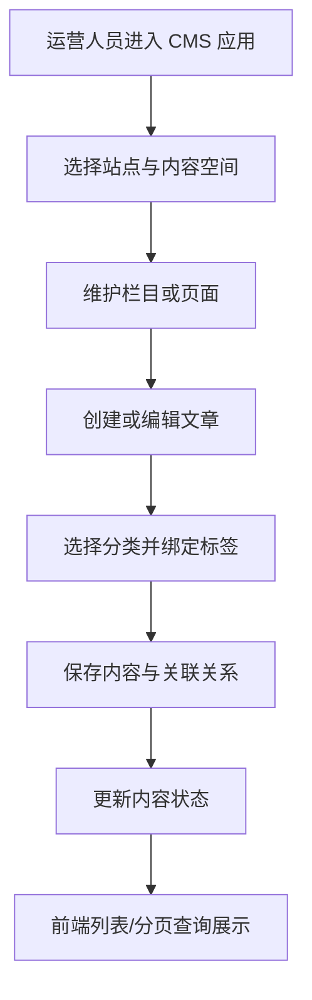

<p align="center">
  
</p>

# g2rain-cms

[](LICENSE)
[](https://openjdk.org/)
[](https://spring.io/projects/spring-boot)
[](https://spring.io/projects/spring-cloud)
[](https://maven.apache.org/)

> 下一代AI软件开发范式，AI原生Agent平台，开源的企业级SaaS底座。

CMS 内容管理领域服务，拥有站点、内容空间、栏目、页面、文章、分类、标签及文章标签关系数据，并以 API/Biz/Startup 三模块交付查询、写入、状态变化和持久化能力。

[项目文档](docs/index.md) · [官网](https://www.g2rain.com) · [Issues](https://github.com/g2rain/g2rain/issues) · [Discussions](https://github.com/g2rain/g2rain/discussions)

## 目录

- 项目简介
- 平台定位
- 领域说明
- 功能概览
- 使用场景
- 核心流程
- 流程图
- 技术栈
- 环境要求
- 快速开始
- 配置说明
- 构建与镜像
- 代码质量与测试
- 接口示例
- 安全说明
- 与关联仓库的关系
- 模块说明
- 职责边界
- 主要 HTTP 路径
- 常见问题
- 关联仓库
- 参与贡献
- 许可证
- 联系我们
- 致谢

## 项目简介

`g2rain-cms` 面向内容运营和业务应用提供 CMS 后端能力。服务以组织为数据边界，管理站点、空间、栏目、页面和文章，并维护分类、标签及文章标签关系；前端交互由 `g2rain-cms-app` 承担。

## 平台定位

该仓库位于 g2rain 业务服务层，属于 `business-service`，目标采用中央 `java-domain-service 1.0.0`（固定引用 `architecture-v1.0.0`）。App 经 IAM 认证并通过 Gateway 访问 CMS；本仓库不承担认证、网关或前端职责。

## 领域说明

该仓库聚焦于内容管理领域。

核心对象包括：

- 站点与内容空间
- 栏目与独立页面
- 文章及其正文、分类、来源和发布状态
- 标签与文章标签关系

## 功能概览

| 能力 | 说明 |
| --- | --- |
| 站点与空间管理 | 维护 CMS 站点与内容空间，为栏目、页面和文章提供内容归属边界。 |
| 栏目与页面管理 | 提供栏目、页面的列表、分页、保存、删除与状态更新能力。 |
| 文章内容管理 | 提供文章查询、保存、删除及其与分类、标签之间的关系维护。 |
| 分类与标签体系 | 维护文章分类、标签以及文章标签批量关联等内容组织能力。 |

## 使用场景

| 场景 | 说明 |
| --- | --- |
| 搭建多站点内容空间 | 当平台需要按站点和空间组织不同业务或租户的内容时使用。 |
| 管理栏目、页面与文章 | 当运营人员需要创建、编辑、分页查询、启停或删除内容对象时使用。 |
| 构建分类与标签体系 | 当文章需要通过分类、标签和关联关系进行检索与组织时使用。 |

## 核心流程

| 流程 | 关键步骤 | 代码线索 |
| --- | --- | --- |
| 内容创建与组织 | 创建站点或内容空间 → 配置栏目与页面 → 创建文章并选择分类 → 为文章绑定标签 → 通过状态字段控制内容可用性 | WebSiteController、SpaceController、ChannelController、PageController、ArticleController、ArticleTagRelationController |
| 内容查询与维护 | 前端按条件请求列表或分页接口 → Controller 调用业务 Service → 持久化层查询内容数据 → 返回统一分页或列表结果 → 保存、删除或更新状态后刷新页面 | g2rain-cms-api、g2rain-cms-biz、ArticleService、PageService、TagService |

## 流程图



## 技术栈

| 类别 | 说明 |
| --- | --- |
| 运行时 | Java 25、Spring Boot 4.0.5、Spring Cloud 2025.1.1 |
| 安全与令牌 | g2rain-starter-aegis-core |
| 数据与发现 | MySQL、MyBatis、Redis、Nacos |
| 平台基础 | g2rain-common、Aegis Core、MyBatis Extensions、SpringDoc |
| 构建部署 | Maven、Spring Boot Maven Plugin、Jib |

## 环境要求

- JDK 25+
- Maven 3.9+
- MySQL 8.0.13+
- Redis
- Nacos

## 快速开始

| 步骤 | 命令或位置 | 说明 |
| --- | --- | --- |
| 准备运行环境 | JDK 25、Maven 3.9+、MySQL 8.0.13+、Nacos | Redis 是否必须由当前启用的 Starter 与外部配置决定。 |
| 初始化空库 | `scripts/cms.sql` | 仅用于新环境；已有数据环境需要独立增量迁移。 |
| 调整配置 | `g2rain-cms-startup/src/main/resources/application.yml` | 设置端口、Profile、Nacos 与数据源；不要使用生产凭据修改仓库文件。 |
| 验证项目 | `mvn clean verify` | 编译并打包所有模块；当前没有自动化测试。 |
| 本地启动 | `mvn -pl g2rain-cms-startup -am spring-boot:run` | 从根目录构建依赖并启动 Startup，默认端口 8080、Profile 为 `dev`。 |

版本号以项目构建配置为准，当前识别为 `1.0-SNAPSHOT`。

## 配置说明

| 类别 | 关键配置 | 说明 |
| --- | --- | --- |
| 运行 | `SERVER_PORT`、`SPRING_PROFILES_ACTIVE` | 默认端口 8080、Profile 为 `dev`。 |
| 服务发现/配置 | Nacos 地址、凭据、namespace、group、service、config import | 服务名为 `g2rain-cms`，支持配置刷新。 |
| 数据库 | MySQL host、port、database、username、password | 开发配置存在本地默认值，生产必须外部注入。 |
| MyBatis | Mapper 路径、下划线映射、缓存和 JDBC null 类型 | Mapper 位于 Biz 模块资源目录。 |
| 平台 Web | 登录守卫、身份参数注入、异常/Result 包装 | 由 g2rain Web/Aegis 能力控制。 |
| 数据隔离 | `g2rain.data.isolation.enabled` | 开启不代表所有 DAO 已正确声明组织隔离。 |
| 运维 | SpringDoc 与 Actuator | 暴露范围按生产安全策略收敛。 |

敏感配置只通过 Secret、环境变量或配置中心注入。详见[配置文档](docs/operations/configuration.md)。

## 构建与镜像

| 目标 | 命令 | 产物 | 说明 |
| --- | --- | --- | --- |
| 完整验证 | `mvn clean verify` | 三个模块 JAR、sources 与 Javadoc | 构建整个 Reactor；当前实际测试数为 0。 |
| 可执行 Jar | `mvn clean package` | `g2rain-cms-startup/target/g2rain-cms-startup-1.0-SNAPSHOT.jar` | 由 Startup 模块生成 Spring Boot 可执行 JAR。 |
| 本地运行 | `mvn -pl g2rain-cms-startup -am spring-boot:run` | 本地 Spring Boot 进程 | 从根目录启动，并构建 API/Biz 依赖。 |
| 本地镜像 | `./build.sh <tag>` | `g2rain/g2rain-cms:<tag>` | 先跳过测试安装 Reactor，再通过 Jib 执行 `dockerBuild`。 |

## 代码质量与测试

2026-09-05 执行 `mvn clean verify`，根项目、API、Biz、Startup 共 4 个 Reactor 项目全部成功。API、Biz 和 Startup 都报告 `No tests to run`，因此结果仅证明当前工作树可以编译、打包并生成 source/Javadoc 产物。

数据库、事务、组织隔离、Controller、Nacos 启动、Gateway 和 CMS App 集成均未通过自动化测试验证。详见[测试策略](docs/development/testing.md)。

## 接口示例

以下示例使用占位 Token；实际平台调用应经 Gateway，并由服务端校验身份、组织和权限。

### 查询文章列表

```bash
curl -H "Authorization: Bearer <access-token>" \
  "http://localhost:8080/article/list?spaceId=<space-id>&status=PUBLISHED"
```

### 保存文章

```bash
curl -X POST "http://localhost:8080/article/save" \
  -H "Authorization: Bearer <access-token>" \
  -H "Content-Type: application/json" \
  -d '{"spaceId":1,"categoryId":2,"title":"示例文章","contentType":"MARKDOWN","content":"# Hello","status":"DRAFT"}'
```

### 为文章批量添加标签

```bash
curl -X POST "http://localhost:8080/article_tag_relation/batch_add_tags" \
  -H "Authorization: Bearer <access-token>" \
  -H "Content-Type: application/json" \
  -d '{"articleId":1,"tagIds":[10,11]}'
```

## 安全说明

| 主题 | 说明 |
| --- | --- |
| 访问入口 | App 经 IAM 认证后通过 Gateway 访问；内部 URL 和 OpenAPI 隐藏不能替代授权。 |
| 组织隔离 | `organId`、来源应用与调用主体必须来自可信上下文；当前 DAO 隔离覆盖不一致。 |
| 隔离绕过 | `@IgnoreIsolation` 只允许明确受信流程使用，并由 Service 补足组织和权限校验。 |
| 内容安全 | Markdown/HTML 展示端需要执行输出编码或可信净化；列表接口遵循正文最小化。 |
| 配置安全 | 数据库、Nacos、Token 和密钥通过外部 Secret 注入，不复制到日志和文档。 |

完整边界见[安全文档](docs/security/security-boundaries.md)。

## 与关联仓库的关系

本仓库作为 CMS 业务后端，与 `g2rain-cms-app` 协同提供内容管理体验；App 从 IAM 获得凭证并经 Gateway 调用本服务。本服务复用 g2rain-common 的模型/工具与 MyBatis Extensions 的分页、组织隔离能力。

## 模块说明

| 模块 | 职责说明 | 代码线索 |
| --- | --- | --- |
| `g2rain-cms-api` | 定义 8 组列表/分页查询契约、SelectDto、VO，以及按文章批量查询标签契约。 | `g2rain-cms-api/src/main/java/com/g2rain/cms` |
| `g2rain-cms-biz` | 实现 Controller、Service、写入 DTO、DAO、Mapper 和 MapStruct 转换。 | `g2rain-cms-biz/src/main` |
| `g2rain-cms-startup` | 提供 Spring Boot 入口、Web/Actuator、Nacos 配置和 Jib 镜像。 | `g2rain-cms-startup` |

## 职责边界

该仓库主要负责：

- 站点、空间、栏目、页面、文章、分类、标签和文章标签关系的数据所有权。
- CMS 查询、保存、状态变化、标签绑定和逻辑删除用例。
- CMS API 契约、领域规则、事务、组织隔离和数据库持久化。

该仓库默认不负责：

- 不负责 CMS 管理端页面和浏览器交互。
- 不负责 IAM 认证、Token 签发或 Gateway 路由与鉴权。
- 不拥有平台组织主数据，也不能只依赖客户端 `organId` 作为可信边界。
- 不向其他服务发布宽泛远程 CRUD，把 CMS 当作远程数据库。

## 主要 HTTP 路径

| 资源前缀 | 查询 | 写入与业务动作 |
| --- | --- | --- |
| `/web_site` | `GET /list`、`GET /page` | `POST /save`、`POST /update_status`、`DELETE /{id}` |
| `/space` | `GET /list`、`GET /page` | `POST /save`、`POST /update_status`、`DELETE /{id}` |
| `/channel` | `GET /list`、`GET /page` | `POST /save`、`POST /update_status`、`DELETE /{id}` |
| `/page` | `GET /list`、`GET /page` | `POST /save`、`POST /update_status`、`DELETE /{id}` |
| `/article` | `GET /list`、`GET /page` | `POST /save`、`DELETE /{id}` |
| `/article_category` | `GET /list`、`GET /page` | `POST /save`、`POST /update_status`、`DELETE /{id}` |
| `/tag` | `GET /list`、`GET /page`、`POST /by_article` | `POST /save`、`DELETE /{id}` |
| `/article_tag_relation` | `GET /list`、`GET /page` | `POST /batch_add_tags`、`POST /save`、`DELETE /{id}` |

API 模块主要发布查询契约；写入端点由 Biz Controller 提供。`POST /tag/by_article` 是批量查询语义。

## 常见问题

| 问题 | 可能原因 | 处理建议 |
| --- | --- | --- |
| 内容列表为空 | 站点、空间、状态或分页查询条件不匹配。 | 检查请求条件、数据隔离上下文和对应内容状态。 |
| 文章标签未生效或重复 | 参数为空、关系未保存，或并发请求缺少唯一约束。 | 检查批量绑定入参、事务日志，并为有效关系建立数据库唯一防线。 |
| 服务无法读取配置 | Nacos、MySQL 或运行环境配置不正确。 | 检查 Profile、配置导入、数据库连接与 Nacos namespace/group。 |
| 文章列表响应过大 | 当前工作树把正文加入列表/分页 VO。 | 明确列表与详情契约，避免列表返回不必要正文。 |
| 删除后编码无法重建 | 普通唯一键使已删除记录继续占位。 | 先确认领域语义，再按增量迁移方式调整唯一索引。 |

## 关联仓库

| 仓库 | 协作关系 |
| --- | --- |
| `g2rain-cms-app` | CMS 管理端业务前端，经 Gateway 调用本服务。 |
| `g2rain-gateway-webflux` | App 请求的统一鉴权与转发入口。 |
| `g2rain-iam` | 为前端提供认证、授权和 Token。 |
| `g2rain-common` | Result、分页、基础模型、断言、时间和 ID 抽象。 |
| `g2rain-mybatis-extensions` | MyBatis 分页与组织数据隔离能力。 |

## 参与贡献

我们欢迎所有形式的贡献：Issue 反馈、文档改进、功能建议与代码提交。

推荐流程：

1. Fork 本仓库。
2. 创建特性分支：`git checkout -b feature/your-feature-name`。
3. 提交更改：`git commit -m "Add some feature"`。
4. 推送分支：`git push origin feature/your-feature-name`。
5. 提交 Pull Request。

代码贡献前请尽量补充必要的测试和文档，并确保构建、测试与静态检查通过。

## 许可证

本项目基于 [Apache License 2.0](LICENSE) 开源。

## 联系我们

- Issues: [GitHub Issues](https://github.com/g2rain/g2rain/issues)
- 讨论: [GitHub Discussions](https://github.com/g2rain/g2rain/discussions)
- 邮箱: g2rain_developer@163.com

## 致谢

感谢所有为 g2rain 项目提交 Issue、代码、文档、建议和使用反馈的开发者们！
