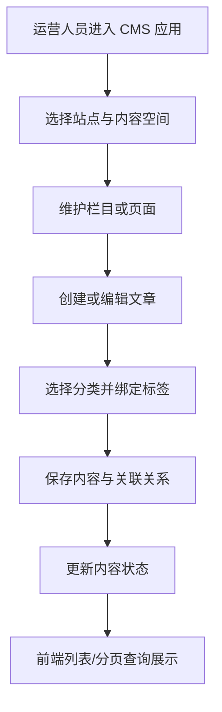



  

# g2rain-cms

下一代AI软件开发范式，AI原生Agent平台，开源的企业级SaaS底座。

CMS 内容管理业务服务，围绕站点、空间、栏目、页面、文章、分类与标签提供内容管理能力；采用 API、业务实现与启动模块分层组织后端工程

[官网](https://www.g2rain.com) · [Issues](https://github.com/g2rain/g2rain/issues) · [Discussions](https://github.com/g2rain/g2rain/discussions)

## 目录

- 项目简介
- 平台定位
- 功能概览
- 功能概览
- 使用场景
- 核心流程
- 流程图
- 技术栈
- 环境要求
- 快速开始
- 构建与镜像
- 安全说明
- 与关联仓库的关系
- 模块说明
- 职责边界
- 主要 HTTP 路径
- 常见问题
- 关联仓库
- 参与贡献
- 许可证
- 联系我们
- 致谢

## 项目简介

CMS 内容管理业务服务，围绕站点、空间、栏目、页面、文章、分类与标签提供内容管理能力；采用 API、业务实现与启动模块分层组织后端工程

## 平台定位

该仓库位于 g2rain 业务服务层，围绕具体业务域提供后端服务能力。

## 功能概览

该仓库聚焦于 `内容管理`。

核心对象包括：
- 应用

## 功能概览

| 能力 | 说明 |
| --- | --- |
| 站点与空间管理 | 维护 CMS 站点与内容空间，为栏目、页面和文章提供内容归属边界。 |
| 栏目与页面管理 | 提供栏目、页面的列表、分页、保存、删除与状态更新能力。 |
| 文章内容管理 | 提供文章查询、保存、删除及其与分类、标签之间的关系维护。 |
| 分类与标签体系 | 维护文章分类、标签以及文章标签批量关联等内容组织能力。 |

## 使用场景

| 场景 | 说明 |
| --- | --- |
| 搭建多站点内容空间 | 当平台需要按站点和空间组织不同业务或租户的内容时使用。 |
| 管理栏目、页面与文章 | 当运营人员需要创建、编辑、分页查询、启停或删除内容对象时使用。 |
| 构建分类与标签体系 | 当文章需要通过分类、标签和关联关系进行检索与组织时使用。 |

## 核心流程

| 流程 | 关键步骤 | 代码线索 |
| --- | --- | --- |
| 内容创建与组织 | 创建站点或内容空间 → 配置栏目与页面 → 创建文章并选择分类 → 为文章绑定标签 → 通过状态字段控制内容可用性 | WebSiteController、SpaceController、ChannelController、PageController、ArticleController、ArticleTagRelationController |
| 内容查询与维护 | 前端按条件请求列表或分页接口 → Controller 调用业务 Service → 持久化层查询内容数据 → 返回统一分页或列表结果 → 保存、删除或更新状态后刷新页面 | g2rain-cms-api、g2rain-cms-biz、ArticleService、PageService、TagService |

## 流程图

## 技术栈

| 类别 | 说明 |
| --- | --- |
| 运行时 | Java 25、Spring Boot 4.0.5、Spring Cloud 2025.1.1 |
| 安全与令牌 | g2rain-starter-aegis-core |
| 基础设施 | Redis、Nacos |
| 其他 | Lombok |

## 环境要求

- JDK 25+
- Maven 3.9+
- Redis
- Nacos

## 快速开始

| 步骤 | 命令或位置 | 说明 |
| --- | --- | --- |
| 准备运行环境 | JDK 25+、Maven 3.9+、Redis、Nacos | 后端服务启动前需要准备 Java 构建环境和平台依赖的基础设施。 |
| 调整配置 | `src/main/resources/application.yml` | 按需设置 SERVER_PORT、SPRING_PROFILES_ACTIVE、NACOS_SERVER_ADDR 等环境变量。 |
| 构建项目 | `mvn clean package` | 执行 Maven 构建并生成可执行 Jar。 |
| 本地启动 | `mvn spring-boot:run` | 以当前 profile 启动服务，默认端口以 application.yml 中的 SERVER_PORT 为准。 |

版本号以项目构建配置为准，当前识别为 `1.0-SNAPSHOT`。

## 构建与镜像

| 目标 | 命令 | 产物 | 说明 |
| --- | --- | --- | --- |
| 可执行 Jar | `mvn clean package` | `g2rain-cms-1.0-SNAPSHOT.jar` | 执行 Maven 标准构建，生成服务可执行产物。 |
| 本地运行 | `mvn spring-boot:run` | 本地 Spring Boot 进程 | 使用当前 profile 启动服务，便于本地联调。 |
| 构建脚本 | `./build.sh` | 脚本定义的构建结果 | 仓库提供 build.sh，可承载组织内约定的镜像或发布流程。 |

## 安全说明

| 主题 | 说明 |
| --- | --- |
| 内容操作权限 | 站点、栏目、页面和文章的写操作应通过网关与平台权限体系限制到具备管理权限的主体。 |
| 内容输入安全 | 富文本或 Markdown 内容在展示前应执行必要的内容过滤，避免不可信脚本进入页面。 |
| 数据隔离 | 站点、空间和内容对象需要遵循平台组织或租户数据隔离规则。 |

## 与关联仓库的关系

本仓库作为 CMS 业务后端，与 g2rain-cms-app 协同提供内容管理界面与业务 API，并复用 g2rain-common 等后端公共能力。

## 模块说明

| 模块 | 职责说明 | 代码线索 |
| --- | --- | --- |
| g2rain-cms-api | 定义文章、分类、标签、栏目、页面、空间和站点等业务 API 契约。 | g2rain-cms-api/src/main/java/com/g2rain/cms/api |
| g2rain-cms-biz | 实现 CMS 控制器、业务服务与持久化逻辑。 | g2rain-cms-biz/controller、service、repository |
| g2rain-cms-startup | 提供 Spring Boot 启动入口与运行配置装配。 | g2rain-cms-startup、application.yml |

## 职责边界

该仓库主要负责：
- 负责具体业务域的 API、业务规则、数据持久化与状态维护
- 负责站点、空间、栏目、页面、文章、分类与标签等内容管理能力

该仓库默认不负责：
- 不负责平台统一认证、网关路由和基础主数据的权威管理
- 不负责业务前端界面与浏览器侧交互实现

## 主要 HTTP 路径

| 方法 | 路径 | 说明 |
| --- | --- | --- |
| DELETE | /article/{id} | 对外暴露的服务接口 |
| DELETE | /article_category/{id} | 对外暴露的服务接口 |
| DELETE | /article_tag_relation/{id} | 对外暴露的服务接口 |
| DELETE | /channel/{id} | 对外暴露的服务接口 |
| DELETE | /page/{id} | 对外暴露的服务接口 |
| DELETE | /space/{id} | 对外暴露的服务接口 |
| DELETE | /tag/{id} | 对外暴露的服务接口 |
| DELETE | /web_site/{id} | 对外暴露的服务接口 |
| GET | /abc | 对外暴露的服务接口 |
| GET | /list | 对外暴露的服务接口 |
| GET | /page | 对外暴露的服务接口 |
| POST | /article/save | 对外暴露的服务接口 |
| POST | /article_category/save | 对外暴露的服务接口 |
| POST | /article_category/update_status | 对外暴露的服务接口 |
| POST | /article_tag_relation/batch_add_tags | 对外暴露的服务接口 |
| POST | /article_tag_relation/save | 对外暴露的服务接口 |
| POST | /by_article | 对外暴露的服务接口 |
| POST | /channel/save | 对外暴露的服务接口 |
| POST | /channel/update_status | 对外暴露的服务接口 |
| POST | /page/save | 对外暴露的服务接口 |
| POST | /page/update_status | 对外暴露的服务接口 |
| POST | /space/save | 对外暴露的服务接口 |
| POST | /space/update_status | 对外暴露的服务接口 |
| POST | /tag/save | 对外暴露的服务接口 |
| POST | /web_site/save | 对外暴露的服务接口 |
| POST | /web_site/update_status | 对外暴露的服务接口 |

## 常见问题

| 问题 | 可能原因 | 处理建议 |
| --- | --- | --- |
| 内容列表为空 | 站点、空间、状态或分页查询条件不匹配。 | 检查请求条件、数据隔离上下文和对应内容状态。 |
| 文章标签未生效 | 文章标签关联未保存，或批量关联参数不完整。 | 检查 ArticleTagRelation 接口参数、文章与标签标识及事务日志。 |
| 服务无法读取配置 | Nacos、MySQL 或运行环境配置不正确。 | 检查配置中心地址、数据库连接和启动模块 application.yml。 |

## 关联仓库

| 仓库 | 协作关系 |
| --- | --- |
| g2rain-common | 复用平台公共规范、通用模型、工具能力或基础依赖约束。 |

## 参与贡献

我们欢迎所有形式的贡献：Issue 反馈、文档改进、功能建议与代码提交。

推荐流程：

1. Fork 本仓库。
2. 创建特性分支：`git checkout -b feature/your-feature-name`。
3. 提交更改：`git commit -m "Add some feature"`。
4. 推送分支：`git push origin feature/your-feature-name`。
5. 提交 Pull Request。

代码贡献前请尽量补充必要的测试和文档，并确保构建、测试与静态检查通过。

## 许可证

本项目基于 [Apache 2.0许可证](https://github.com/g2rain/g2rain-common/blob/main/LICENSE) 开源。

## 联系我们

- Issues: [GitHub Issues](https://github.com/g2rain/g2rain/issues)
- 讨论: [GitHub Discussions](https://github.com/g2rain/g2rain/discussions)
- 邮箱: g2rain_developer@163.com

## 致谢

感谢所有为 g2rain 项目提交 Issue、代码、文档、建议和使用反馈的开发者们！
