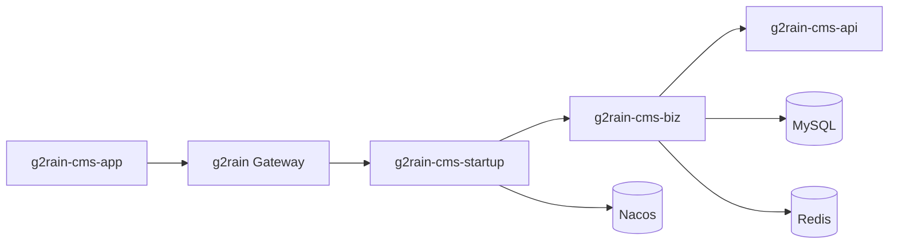

# 架构总览

`g2rain-cms` 是 g2rain 业务服务层的内容管理领域服务，目标采用 `java-domain-service 1.0.0`。它拥有站点、内容空间、栏目、页面、文章、分类、标签与文章标签关系数据，并通过 HTTP 接口支持 CMS 管理用例。

## 主要能力

- 站点与内容空间的列表、分页、保存、状态变更和逻辑删除。
- 栏目与独立页面的组织、内容、路径和发布状态维护。
- 文章正文、摘要、分类、来源、作者和发布状态维护。
- 文章分类与标签维护，文章标签批量查询和批量绑定。
- MyBatis Mapper、分页扩展、组织数据隔离和统一响应模型。

前端交互由 `g2rain-cms-app` 负责；认证和 Token 属于 IAM；外部 App 应经 Gateway 访问本服务。

